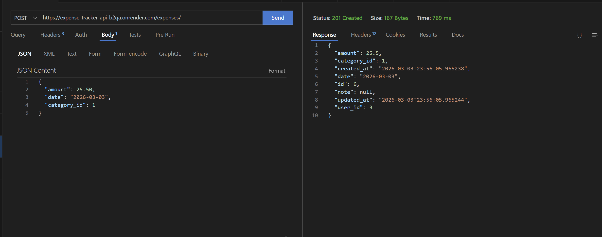
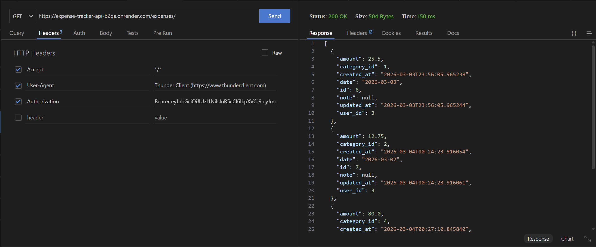
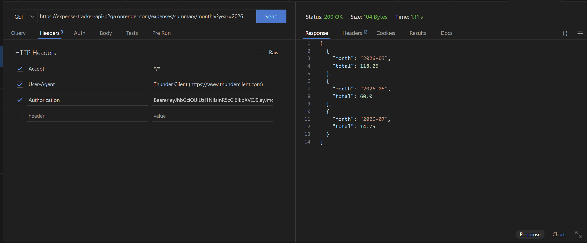

# Expense Tracker API

A RESTful expense tracking API built with Flask, SQLAlchemy, and JWT authentication.

## Features
- User authentication (JWT)
- Create, update, and delete expenses
- Categorize expenses
- Monthly expense summary analytics
- Deployed API

## Tech Stack
- Python
- Flask
- SQLAlchemy
- Marshmallow
- JWT Authentication
- PostgreSQL
- Render (deployment)

## API Endpoints

### Auth
POST /auth/register  
POST /auth/login  

### Expenses
GET /expenses  
POST /expenses  
PUT /expenses/{id}  
DELETE /expenses/{id}

### Analytics
GET /expenses/summary/monthly?year=2026

## Deployment
API is deployed on Render.

Example request:

GET
https://expense-tracker-api-b2qa.onrender.com/expenses

## Example Response
{
  "month": "2026-03",
  "total": 118.25
}

## Screenshots

### Create Expense

### List Expenses

### Monthly Summary

